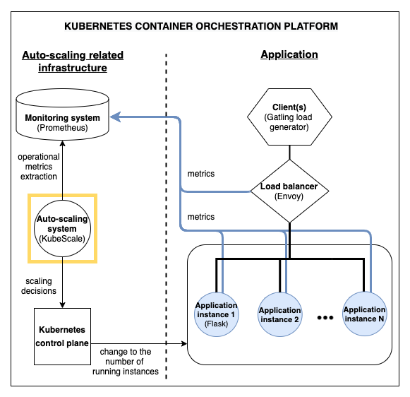

Evaluation platform for auto-scalers
=====================

Contents:
- [Introduction to the auto-scaler evaluation platform](#high-level)
- [Repository contents](#contents)
- [Platform setup and installation](#setup)
- [Running experiments](#exp-setup)

Auto-scaler evaluation platform <a name="high-level"></a>
------------------

This platform for evaluating auto-scalers was created during the development of KubeScale auto-scaler.
The platform presents a perfect testing ground for auto-scaler since it provides:
- workload generation based on templates executed by Gatling
- a web application with minimal start-up overhead based on the flask framework  
- load balancing and related HTTP traffic metrics (used by most cloud auto-scalers) such as RPS, latency... using Envoy
- advanced monitoring using Prometheus, kube-eagle
- easy visualisation of metrics using Grafana 


A high level architecture of the platform is the following:



Any auto-scaler can thus easily integrate by:
- changing the Gatling workloads to those that test the auto-scaler
- using the existing web-application for CPU intensive work
- using the Prometheus monitoring system for storing and reading metrics 
- using the Envoy load balancer for easier scaling, web traffic metrics and advanced load balancing
- ...

Repository contents <a name="contents"></a>
------------------

This repository contains the following folders:
- [helm](helm)
  - contains helm charts to install and configure the monitoring platform in Kubernetes:
        - prometheus - a monitoring setup based on Prometheus operator that ingests internal Kubernetes metrics including providing a Kube metrics server and Custom Metrics APIs
        - grafana -  for user-friendly exploration and visualisation of metrics
            - auto-wired to connect to prometheus and comes with predefined dashboards
        - kube-eagle - installation for precise utilisation metrics
        - prometheus custom metrics adapter
        - prometheus push gateway
        - ...
    
- [kubernetes](kubernetes)
    - definitions for: services, deployments, config maps and secrets that define components running on the platform
    - components
        - load generator - gatling (cron job, config map)
        - load balancer - envoy (deployment)
        - web application that needs auto-scaling(service, deployment)
        - auto-scaler (deployment, config map)
        - storage (local storage provisioning)
        - ...
    
- [kubespray-setup](kubespray-setup)
    - a guide to installing a Kubernetes cluster using Kubespray (specific instruction are limited to Ubuntu machines but KubeScale should work in various environments)
    
- [load_generation](load_generation)
    - Gatling load generator for sending requests to the web application based on pre-defined patterns
        - contains the configs to get Gatling load generation tool running in a Docker container 
    
- [web_application](web_application)
    - a stateless  Python Flask web application with simple REST API endpoints that perform CPU intensive tasks and that would be scaled
    
and the following scripts:

- `script.sh`
    - instructions on how to deploy all components of the platform
    
- `experiment_runner.sh`
    - script for running experiments that test auto-scalers using workloads, applications and monitoring metrics on the evaluation platform
    

Platform setup and installation <a name="setup"></a>
------------------ 

1) Setup a Kubernetes cluster (the repository contains the instructions on how to do this using KubeSpray inside [kubespray-setup](kubespray-setup)).

2) Install kubectl and create a namespace in your Kubernetes cluster
The Kubernetes cluster creation document [here](./_initial_kubespray_setup/setup_instructions.md) contains the instructions to setup kubectl after the KubeSpray cluster instalation. 

3) Setup a config map with the kubectl config (required for the auto-scaler to work)

4) Setup a secret with an email username/password combination (optional for kubes-scale autoscaler to send email notifications)

5) Setup authentication to a docker registry
    - Resources on using private repositories (GCR):
        - https://cloud.google.com/container-registry/docs/pushing-and-pulling
        - https://kubernetes.io/docs/tasks/configure-pod-container/pull-image-private-registry/
      - To create the relevant in Kubernetes for exm this command:
        ```
        kubectl create secret docker-registry gcr-json-key --docker-server=gcr.io --docker-username=_json_key --docker-password="$(cat /Users/dbg/code/IdeaProjects/act_project/kubernetes/secrets/our-rock-280920-009255fa8bb1.json)" --docker-email=some@gmail.com
        ```

6) Make sure the nodes are properly labeled as exemplified in the `kubespray-setup/labels.txt` file.

7) Install helm (we remained using version 2)
   - On MacOS:
        ```
        brew install helm@2
        echo 'export PATH="/usr/local/opt/helm@2/bin:$PATH"' >> ~/.bash_profile
        ```
   - Helm assumes it's using the same config file as kubectl (`$HOME/.kube/config`) by default.
   - Update helm (to make sure client and Tiller server are same versions)
        ```
        helm init --history-max 200
        helm init --upgrade
        ```

Experiment setup <a name="exp-setup"></a>
--------------------------------

First read through and then run the setup.sh script with the relevant Kubernetes namespace name:
```
./setup.sh
```

#### Experiment running

The experiments depend on several parameters:
- scaling metric
- workload
- initial number of instances

Run the experiments using:
```
experiment_runner.sh` <web application name> <scaling metric> <workload type> <num instances>
````

In the experiments, workload is generated based on Gatling patterns each 30 minutes and is repeated 7 times (in total lasting 3.5 hours).

Each experiment ran the chosen workload against:
- 1 - a static number of instances
- 2 - the Kubescale auto-scaler  
- 3 - just the reactive component of the Kubescale auto-scaler 
- 4 - the Kubernetes horizontal pod autoscaler
